# Custom Authorization & Ingress Agent Gateway Demos

This repository implements secure ingress gateways with custom authorization controls for AI agents on Google Cloud. It provides three target deployment architectures:

1. **Cloud Run Target (Global ALB)**: Deploying ReAct agents directly to Google Cloud Run secured by an external Global Application Load Balancer (ALB) and custom authz service extensions.
2. **Vertex AI Agent Runtime Target (Two-Tier Ingress)**: Deploying ReAct agents into Vertex AI Agent Runtime (Reasoning Engines), secured by a two-tier Consumer-Producer PSC gateway architecture.
3. **Regional Cloud Run Target (Regional ALB - Pure `gcloud`)**: Deploying ReAct agents to Cloud Run frontended by a Regional External Application Load Balancer with gRPC Service Extensions using pure CLI scripts.

---

## Architecture Overview

```mermaid
graph TD
    subgraph "Cloud Run Target (Global ALB)"
        CR_Client[Client] -->|HTTPS| CR_ALB[Global Load Balancer]
        CR_ALB -->|ext_proc / ext_authz| CR_Authz[Custom Authz Cloud Run]
        CR_ALB -->|Forward ALLOWED| CR_Agent[ReAct Agent Backend]
    end

    subgraph "Agent Runtime Target (Two-Tier)"
        RT_Client[Client] -->|HTTPS| RT_ALB_T1[Tier 1 Global ALB]
        RT_ALB_T1 -->|ext_proc| RT_Authz[Custom Authz Cloud Run]
        RT_ALB_T1 -->|PSC NEG| RT_Attachment[PSC Service Attachment]
        RT_Attachment -->|VPC Transit| RT_ALB_T2[Tier 2 Internal ALB]
        RT_ALB_T2 -->|PSC NEG| RT_Vertex[Vertex AI Reasoning Engine]
    end

    subgraph "Regional Cloud Run Target (Regional ALB)"
        REG_Client[Client] -->|HTTPS| REG_ALB[Regional External ALB]
        REG_ALB -->|ext_proc| REG_Echo[gRPC Echo / Authz Cloud Run]
        REG_ALB -->|Forward ALLOWED| REG_Agent[ReAct Agent Backend]
    end
```



---

## Directory Structure

* [**`REGIONAL_GATEWAY_GUIDE.md`**](file:///Users/rajeshmi/projects/custom-authz-agent-gateway/REGIONAL_GATEWAY_GUIDE.md): Complete guide for Regional ALB deployment, Service Extensions, testing, and troubleshooting.
* [**`custom-authz-service/`**](file:///Users/rajeshmi/projects/custom-authz-agent-gateway/custom-authz-service): Centralized authorization codebase. Contains the gRPC `ext_authz` and `ext_proc` servers, and the HTTP health/REST proxy server.
* [**`grpc-echo-service/`**](file:///Users/rajeshmi/projects/custom-authz-agent-gateway/grpc-echo-service): Standalone gRPC echo and `ext_proc` demonstration service.
* [**`custom-authz-agent-cloud-run/`**](file:///Users/rajeshmi/projects/custom-authz-agent-gateway/custom-authz-agent-cloud-run): Terraform configurations and resources for wiring up the Global Cloud Run deployment.
* [**`custom-authz-agent-runtime/`**](file:///Users/rajeshmi/projects/custom-authz-agent-gateway/custom-authz-agent-runtime): Terraform configurations and resources for wiring up the Two-Tier Ingress Agent Runtime deployment.
* [**`agents/`**](file:///Users/rajeshmi/projects/custom-authz-agent-gateway/agents): Source code for the backend ReAct agent (`custom-authz-demo-agent`).

---

## Prerequisites

Ensure you have the following tools installed and configured:
* Google Cloud SDK (`gcloud`) authenticated to your GCP project.
* Terraform (`>= 1.5.0`).
* `uv` Python package installer (`pip install uv`).
* `agents-cli` tool.

---

## Deployment Instructions

### 1. Deploying to Cloud Run Target (Global ALB)
Run the Cloud Run orchestration deployment script from the root directory:
```bash
./deploy-agent-cloud-run-demo.sh
```
This script:
1. Builds and deploys the centralized `custom-authz-service` to Cloud Run.
2. Deploys the ReAct agent onto Cloud Run using `agents-cli deploy`.
3. Runs Terraform to wire up the external Application Load Balancer and Service Extension.

### 2. Deploying to Vertex AI Agent Runtime Target
Run the Agent Runtime orchestration deployment script from the root directory:
```bash
./deploy-agent-runtime-demo.sh
```
This script:
1. Builds and deploys the centralized `custom-authz-service` to Cloud Run.
2. Deploys the ReAct agent onto Vertex AI Agent Runtime using `agents-cli deploy`.
3. Runs Terraform to wire up the Tier 1 Global Load Balancer, PSC service attachment tunnels, and Tier 2 Internal Load Balancer routing path.

### 3. Deploying to Regional Cloud Run Target (Pure `gcloud`)
Run the pure `gcloud` regional deployment script:
```bash
./create-regional-lb.sh [LB_NAME] [REGION] [NETWORK]

# Example:
./create-regional-lb.sh my-agent-lb us-central1 default
```
See [**`REGIONAL_GATEWAY_GUIDE.md`**](file:///Users/rajeshmi/projects/custom-authz-agent-gateway/REGIONAL_GATEWAY_GUIDE.md) for complete details.

---

## Verification and Testing

### Testing Global Cloud Run Target
Query the Cloud Run backend agent through the Global ALB:
```bash
./test-agent.sh "What is the weather in Fremont?" cloud-run
```

### Testing Agent Runtime Target
Query the Vertex AI Reasoning Engine backend agent:
```bash
./test-agent.sh "What is the weather in Fremont?" runtime
```

### Testing Regional Cloud Run Target
Query the Cloud Run backend agent through the Regional ALB:
```bash
./test-regional.sh "What is the weather in Fremont?" my-agent-lb us-central1
```

---

## Development & Local Testing

You can run local unit tests for the centralized authorization service using `uv`:
```bash
cd custom-authz-service
uv sync
uv run pytest
```

---

## Cleanup & Teardown

To clean up deployed Google Cloud infrastructure and services:

### Cleaning up Global Cloud Run Target
```bash
./cleanup-agent-cloud-run-demo.sh
```

### Cleaning up Agent Runtime Target
```bash
./cleanup-agent-runtime-demo.sh
```

### Cleaning up Regional Load Balancer Target
```bash
./cleanup-regional-lb.sh my-agent-lb us-central1
```

