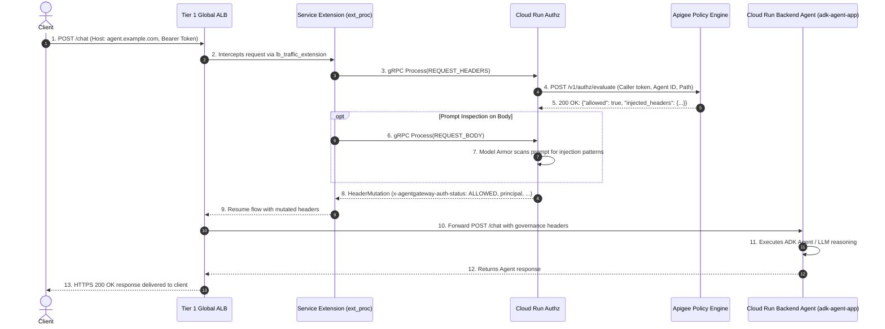

# Cloud Run Custom Authz & Ingress Gateway Architecture

## Overview & Architecture

This repository provides an enterprise reference implementation for exposing and governing AI Agents hosted on **Google Cloud Run (e.g. `adk-agent-app` built with the Agent Development Kit / FastAPI)** through a **Tier 1 Global Application Load Balancer (Anycast IP)** with inline authorization and prompt guardrails powered by **Google Cloud Service Extensions (`ext_proc`)**, a **Cloud Run Custom Authz Service**, and the **Apigee Policy Engine**.

```mermaid
graph TD
    Client["Client / User / Application"] -->|HTTPS (Anycast IP)| ALB["Tier 1: Global External Application Load Balancer<br/>• Anycast IP + TLS Termination<br/>• Cloud Armor WAF & Rate Limiting<br/>• URL Map Routing"]
    
    subgraph Service Extension & Governance
        ALB -->|1. ext_proc gRPC (REQUEST_HEADERS / BODY)| Authz["Cloud Run Custom Authz Service<br/>• Envoy ext_proc Servicer<br/>• Model Armor Prompt Guardrail<br/>• Header Mutation Engine"]
        Authz -->|2. REST Policy Evaluation| Apigee["Apigee Policy Engine<br/>• Identity & Scopes<br/>• Enterprise Policy Rules<br/>• Quota / Rate Limiting"]
        Apigee -->>|3. Allowed + Enrichment Headers| Authz
    end

    subgraph Backend Execution
        Authz -->>|4. HeaderMutation (ALLOWED)| ALB
        ALB -->|5. Forward with Governance Headers| Backend["Cloud Run Backend Agent<br/>(e.g. adk-agent-app)<br/>• Verified Principal Context<br/>• Agent LLM Reasoning & Tools"]
    end
```

---

## Architectural Components

### 1. Tier 1: Global External Application Load Balancer
- **Global Anycast IP & Edge TLS**: Provides single, DDoS-protected anycast IP address terminating HTTPS client connections with managed or custom TLS certificates.
- **Google Cloud Armor**: Enforces edge perimeter protection, IP rate limiting (e.g., 100 req/min), and WAF filtering before processing.
- **Serverless Network Endpoint Groups (NEGs)**: Routes authorized traffic directly to Cloud Run services without VPC egress overhead.

### 2. Google Cloud Service Extension (`lb_traffic_extension`)
- **Protocol**: Envoy `ext_proc` (External Processing) over gRPC (HTTP/2 with `h2c` on Cloud Run).
- **Triggers**: Intercepts `REQUEST_HEADERS` and `REQUEST_BODY` events synchronously at the load balancing edge.
- **Fail-Open / Fail-Close**: Configurable policy enforcement (`fail_open = false` for strict zero-trust security).

### 3. Cloud Run Custom Authz Service (`custom-authz-cloud-run`)
- **Envoy `ext_proc` Servicer**: Implements `envoy.service.ext_proc.v3.ExternalProcessor` gRPC interface.
- **Model Armor & Prompt Guardrails**: Scans incoming request bodies for prompt injection, jailbreak attempts, and disallowed directives before they reach the LLM.
- **Header Mutation**: Injects verified enterprise governance headers (`x-agentgateway-auth-status`, `x-agentgateway-principal`, `x-agent-id`, `x-apigee-org`).

### 4. Apigee Policy Engine
- Evaluates client identity, OAuth2 / JWT tokens, API keys, caller scopes, and agent entitlements.
- Returns authorization decisions (`allowed: true / false`), rejection reasons, and policy enrichment tags.

### 5. Cloud Run Backend Agent (`adk-agent-app`)
- Hosted agent application built with the Agent Development Kit (ADK) or FastAPI.
- Consumes verified caller context from injected headers to enforce tenant isolation and persona-based agent behavior.

---

## Complete Request Sequence Flow



---

## Governance & Security Header Reference

| Injected Header | Source | Description | Example |
| :--- | :--- | :--- | :--- |
| `x-agentgateway-auth-status` | Cloud Run Authz | Authorization verdict passed to backend | `ALLOWED` |
| `x-agentgateway-principal` | Cloud Run Authz | Verified user email / principal identity | `alice@example.com` |
| `x-agentgateway-tenant-id` | Cloud Run Authz | Multi-tenant partition key | `engineering-dept` |
| `x-agent-id` | Cloud Run Authz / Client | Target Agent identifier | `adk-agent-app` |
| `x-apigee-org` | Apigee | Apigee organization handling governance | `enterprise-agent-org` |
| `x-governance-eval` | Apigee | Compliance check evaluation result | `PASSED` |

---

## Comparison: Direct Cloud Run vs. Two-Tier PSC Gateway

| Dimension | Cloud Run Direct Ingress (This Repo) | Two-Tier PSC Gateway (`custom-authz-agent-gateway`) |
| :--- | :--- | :--- |
| **Backend Target** | Serverless Cloud Run Services (`adk-agent-app`) | Vertex AI Reasoning Engines / Managed Google APIs |
| **Topology** | Single Tier (Global External ALB + Serverless NEG) | Two Tier (Tier 1 Global ALB -> PSC -> Tier 2 Internal ALB) |
| **Transit Mechanism** | Serverless NEG (`SERVERLESS`) | Regional PSC Service Attachment & Google APIs PSC NEG |
| **Ideal Use Case** | Custom containerized ADK agents on Cloud Run | Centralized enterprise hub fronting Vertex AI Reasoning Engines |
| **Infrastructure Overhead** | Minimal (no NAT subnets, proxy-only subnets, or PSC endpoints needed) | Higher (requires VPC subnets, NAT, and multi-tier routing) |
