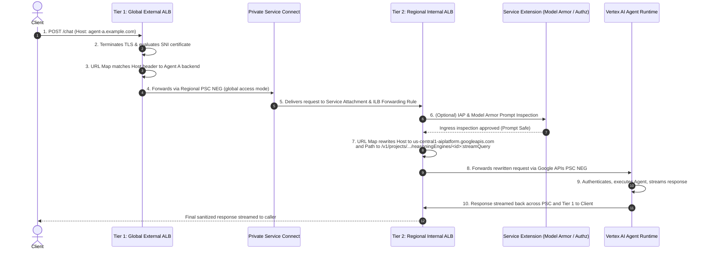

# Self-Managed Ingress Gateway for Gemini Enterprise Agent Platform

## Overview & Reference Architecture

This architecture implements the enterprise reference specification for exposing Agent instances hosted on **Agent Runtime (Vertex AI Reasoning Engines / Agent Development Kit)** through a controlled, policy-enforcing ingress gateway built on Google Cloud load balancing and Private Service Connect (PSC) primitives.

The architecture decouples the gateway into two independently owned tiers joined by Private Service Connect:
1. **External Tier (Tier 1)**: Public front door with coarse-grained policy enforcement (TLS termination, SNI, anycast IP, Cloud Armor, and Identity-Aware Proxy).
2. **Internal Tier (Tier 2)**: Per-agent access with fine-grained policy enforcement, URL host & path rewriting, Model Armor payload inspection, and private forwarding over PSC to Vertex AI Agent Runtime.

```mermaid
graph TD
    Client["Client (agent-a.example.com / agent-b.example.com)"] -->|HTTPS / Anycast IP| Tier1_GLB["Tier 1: Global External Application Load Balancer<br/>• Anycast IP + TLS (SNI)<br/>• URL map: host_rule per backend<br/>• Global backend service (EXTERNAL_MANAGED)<br/>• Google Cloud Armor / Edge IAP"]

    subgraph Consumer Project: Tier 1
        Tier1_GLB -->|Host: agent-a.example.com| PSC_NEG_A["Regional PSC NEG A<br/>(psc_target_service = SA_A)"]
        Tier1_GLB -->|Host: agent-b.example.com| PSC_NEG_B["Regional PSC NEG B<br/>(psc_target_service = SA_B)"]
    end

    PSC_NEG_A -.->|Private Service Connect (global access)| SA_A["Service Attachment A<br/>(allow_global)"]
    PSC_NEG_B -.->|Private Service Connect (global access)| SA_B["Service Attachment B<br/>(allow_global)"]

    subgraph Producer Project A: Tier 2
        SA_A --> ILB_A["Regional Internal ALB A<br/>• INTERNAL_MANAGED<br/>• IAP / Policy Check<br/>• URL map: Host + Path rewrite"]
        ILB_A -->|Service Extension (ext_proc)| ModelArmor_A["Model Armor & Custom Authz<br/>• Ingress Prompt Inspection<br/>• Egress Response Sanitization"]
        ILB_A --> PSC_API_A["PSC NEG to Google APIs<br/>us-central1-aiplatform.googleapis.com"]
    end

    subgraph Producer Project B: Tier 2
        SA_B --> ILB_B["Regional Internal ALB B<br/>• INTERNAL_MANAGED<br/>• IAP / Policy Check<br/>• URL map: Host + Path rewrite"]
        ILB_B --> PSC_API_B["PSC NEG to Google APIs<br/>region-aiplatform.googleapis.com"]
    end

    subgraph Vertex AI Platform: Managed APIs
        PSC_API_A --> Vertex_A["Vertex AI Agent Engine (us-central1)<br/>/v1/projects/.../reasoningEngines/<id>:streamQuery"]
        PSC_API_B --> Vertex_B["Vertex AI Agent Engine (region)<br/>/v1/projects/.../reasoningEngines/<id>:streamQuery"]
    end
```

---

## Architectural Components

### Tier 1: Global External Application Load Balancer (Consumer Project)
- **Global Anycast IP & TLS (SNI)**: Provides a single external IP address, terminates client HTTPS connections, and handles TLS certificates with multiple Subject Alternative Names (SANs) for all agent domains.
- **Host-Based URL Map**: Matches client `Host` headers (`agent-a.example.com`, `agent-b.example.com`) and routes to dedicated global backend services.
- **Regional PSC NEGs**: Type `PSC` network endpoint groups pointing to the respective Tier 2 Service Attachments. Attaching a regional PSC NEG to a global backend service places the connection in **global access mode**.

### Tier 2: Regional Internal Application Load Balancer (Producer Projects)
- **Service Attachment**: Published by each Tier-2 internal load balancer as a `google_compute_service_attachment`. With `enable_proxy_protocol = false` and NAT subnets, this enables cross-project and cross-team decoupled topologies.
- **Regional Internal ALB (`INTERNAL_MANAGED`)**: Provisioned inside a dedicated proxy-only subnet (`purpose = REGIONAL_MANAGED_PROXY`).
- **URL Map (Host & Path Rewriting)**:
  - Rewrites `Host` header to `<region>-aiplatform.googleapis.com`.
  - Rewrites incoming path (e.g. `POST /chat` or `/streamQuery`) to `/v1/projects/<agent_project>/locations/<region>/reasoningEngines/<reasoning_engine_id>:streamQuery`.
- **PSC NEG to Google APIs**: Type `PRIVATE_SERVICE_CONNECT` pointing to `<region>-aiplatform.googleapis.com` so requests reach Vertex AI privately without traversing the public internet.
- **Agent Runtime**: Managed runtime hosting the agent built with the **Agent Development Kit (ADK)** or Vertex AI Reasoning Engines.

---

## Policy Enforcement Matrix

| Enforcement Layer | Service / Primitive | Gateway Tier | Key Responsibilities |
| :--- | :--- | :--- | :--- |
| **Transport Security** | TLS / mTLS | Tier 1 & Tier 2 | Terminates client HTTPS and enforces private transport across Private Service Connect and Google APIs PSC. |
| **Identity & Access** | Identity-Aware Proxy (IAP) | Tier 1 or Tier 2 | Validates principal identity, evaluates Context-Aware Access (CAA) policies, and enforces IAM authorization rules at the edge. |
| **AI Payload Inspection** | Model Armor / Custom Authz | Service Extensions (`ext_proc` / `ext_authz`) | Inspects incoming prompts for injection attacks and sanitizes outgoing agent responses for PII/credential leaks. |

### 1. Identity-Aware Edge Protection (IAP)
- **Identity Verification**: Validates user identity or federated principal against Workforce Identity Pool mapping.
- **Context Evaluation**: Assesses client IP ranges, geographic location, and device posture.
- **IAM Authorization**: Enforces fine-grained IAM permissions bound to the backend service.

### 2. Inline AI Security Inspection (Model Armor)
- **Ingress Prompt Inspection**: Intercepts requests to check for prompt injection patterns, jailbreak attempts, and malicious instructions before forwarding to Agent Runtime.
- **Egress Response Sanitization**: Intercepts streamed or batch responses to sanitize PII leaks, credential exposure, and policy violations before delivering them to clients.

---

## Complete 10-Step Request Flow



1. **Client DNS Resolution**: Client resolves `agent-a.example.com` to the Tier-1 Anycast IP and initiates HTTPS connection.
2. **TLS Termination & SNI**: Tier-1 HTTPS proxy terminates TLS using the certificate matching `agent-a.example.com`.
3. **Host Routing**: Tier-1 URL Map routes request to dedicated Global Backend Service for Agent A.
4. **PSC Forwarding**: Tier-1 forwards request through regional PSC NEG to Tier-2 Service Attachment in global access mode.
5. **Tier-2 Delivery**: Tier-2 Service Attachment delivers request to Regional Internal ALB forwarding rule.
6. **Policy Evaluation**: IAP / IAM rules evaluated and Model Armor inspects incoming prompt.
7. **Host & Path Rewrite**: Tier-2 URL Map updates `Host` header to `<region>-aiplatform.googleapis.com` and path prefix to `/v1/projects/<project>/locations/<region>/reasoningEngines/<id>:streamQuery`.
8. **Private Google API Transit**: Tier-2 backend forwards request through Google APIs PSC NEG.
9. **Agent Execution**: Vertex AI Agent Runtime executes the ADK reasoning engine and streams event chunks.
10. **Response Return**: Response returns through Tier-2 ALB, PSC, Tier-1 GLB, and back to the client.

---

## Design Alternatives

### Single-Tier Gateway vs. Two-Tier Gateway
- **Single-Tier**: Single external load balancer whose backend is a PSC NEG targeting AI Platform API directly. Suitable when all agents reside in the same project and do not require per-agent policy isolation or decoupled ownership.
- **Two-Tier (Reference Architecture)**: Recommended when agents are hosted in separate projects, require per-agent IAP or URL rewriting policies, or backend teams independently manage additions/removals without modifying front-door infrastructure.

### Routing Strategies
- **Hostname Routing (Default)**: `agent-a.example.com` / `agent-b.example.com` provides clean isolation and aligns naturally with per-agent DNS and TLS certificates.
- **Path-Prefix Routing**: Routes under a single hostname (e.g. `gateway.example.com/agent-a/chat`), where Tier 1 strips prefix before Tier 2 applies Reasoning Engine rewrite.
